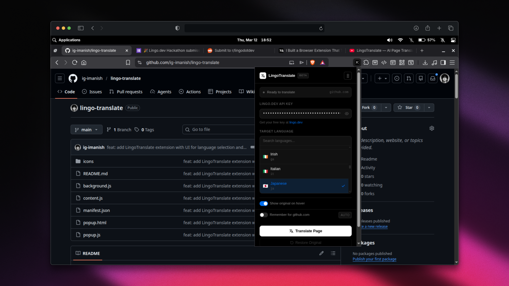

# LingoTranslate — AI Page Translator Browser Extension

> Translate any webpage instantly using **lingo.dev** AI. Select a language, click translate — done.


---

## ✨ Features

- **One-click translation** — Translate the entire page with a single click
- **70+ languages** — Powered by lingo.dev's AI localization engine
- **Smart text extraction** — Skips code blocks, scripts, numbers, and hidden elements
- **Batch processing** — Efficient chunked translation to stay within API limits
- **Hover to reveal original** — Optional "show original on hover" mode
- **Restore original** — Instantly revert the page back to its original text
- **Secure API key storage** — Key stored locally in Chrome storage, never transmitted elsewhere
- **Vercel-inspired UI** — Clean, dark, minimal interface

---

## 🚀 Quick Start

### 1. Get a lingo.dev API Key

1. Go to [lingo.dev](https://lingo.dev)
2. Sign up for a free account (10,000 words/month free)
3. Copy your API key from the dashboard

### 2. Install the Extension

**From source (development):**

```bash
# Clone or download this project
git clone <your-repo>
cd lingo-extension

# No build step needed — pure JS extension!
```

Then load in Chrome:
1. Open `chrome://extensions`
2. Enable **Developer Mode** (top right toggle)
3. Click **Load unpacked**
4. Select the `lingo-extension` folder

### 3. Use It

1. Click the **LingoTranslate** icon in your toolbar
2. Paste your **lingo.dev API key**
3. Search and select a **target language**
4. Click **Translate Page** ✨

---

## 📁 Project Structure

```
lingo-extension/
├── manifest.json          # Chrome Extension Manifest v3
├── popup.html             # Extension popup UI
├── popup.js               # Popup logic, language selector, state management
├── content.js             # Content script — DOM traversal & text replacement
├── background.js          # Service worker — lingo.dev API calls (bypasses CORS)
├── icons/
│   ├── icon16.png
│   ├── icon32.png
│   ├── icon48.png
│   └── icon128.png
└── README.md
```

---

## 🔧 How It Works

```
User clicks Translate
        │
        ▼
popup.js sends message → content.js
        │
content.js walks the DOM
  - Uses TreeWalker to find all text nodes
  - Skips scripts, styles, code, hidden elements
  - Skips numbers, URLs, and short strings
        │
        ▼
Texts chunked into batches of 30
        │
Each chunk → background.js (service worker)
        │
background.js calls lingo.dev API
  POST https://engine.lingo.dev/v1/localize
  { sourceLocale, targetLocale, content: { t0, t1, ... } }
        │
        ▼
Translated text mapped back → DOM nodes replaced
        │
Progress updates sent back to popup via chrome.runtime.sendMessage
        │
        ▼
✅ Page translated!
```

---

## 🌐 Supported Languages

The extension supports **70+ languages** including:

| Language | Code | Language | Code |
|----------|------|----------|------|
| Arabic | `ar` | Japanese | `ja` |
| Chinese (Simplified) | `zh` | Korean | `ko` |
| French | `fr` | Portuguese | `pt` |
| German | `de` | Russian | `ru` |
| Hindi | `hi` | Spanish | `es` |
| Italian | `it` | Turkish | `tr` |

And many more — search in the language picker!

---

## ⚙️ Options

| Option | Description |
|--------|-------------|
| **Show original on hover** | Wraps translated text in `<span>` with `title` attribute showing original |
| **Auto-detect source** | Lets lingo.dev detect the source language automatically |

---

## 🔑 API & Pricing

This extension uses the **lingo.dev Localization Engine API**.

| Tier | Words/month | Cost |
|------|-------------|------|
| Hobby (Free) | 10,000 | $0 |
| Pro | 20,000 | $30/mo |
| Team | 100,000 | $600/mo |

Get started at [lingo.dev](https://lingo.dev) — the free tier is enough for personal use.

---

## 🛠 Development

The extension uses **Manifest V3** with:

- **No build step** — vanilla JS, no bundler needed
- **Service Worker** for background API calls (avoids CORS)
- **Content Scripts** for DOM manipulation
- **Chrome Storage API** for persisting settings

### Permissions Used

- `activeTab` — Access the current tab's DOM
- `storage` — Save API key and preferences locally
- `scripting` — Inject content script programmatically
- `host_permissions: <all_urls>` — Translate on any webpage

---

## 🏆 Built for Hackathon

This project was built as a hackathon submission showcasing:

1. **Real-world API integration** — lingo.dev SDK for production-grade AI translation
2. **Browser extension architecture** — Proper use of Manifest V3, service workers, content scripts
3. **Smart DOM traversal** — Intelligent text extraction that preserves page structure
4. **Progressive UX** — Live progress tracking, batch processing, restore capability

---

## 📄 License

MIT — build on it, hack it, ship it.
